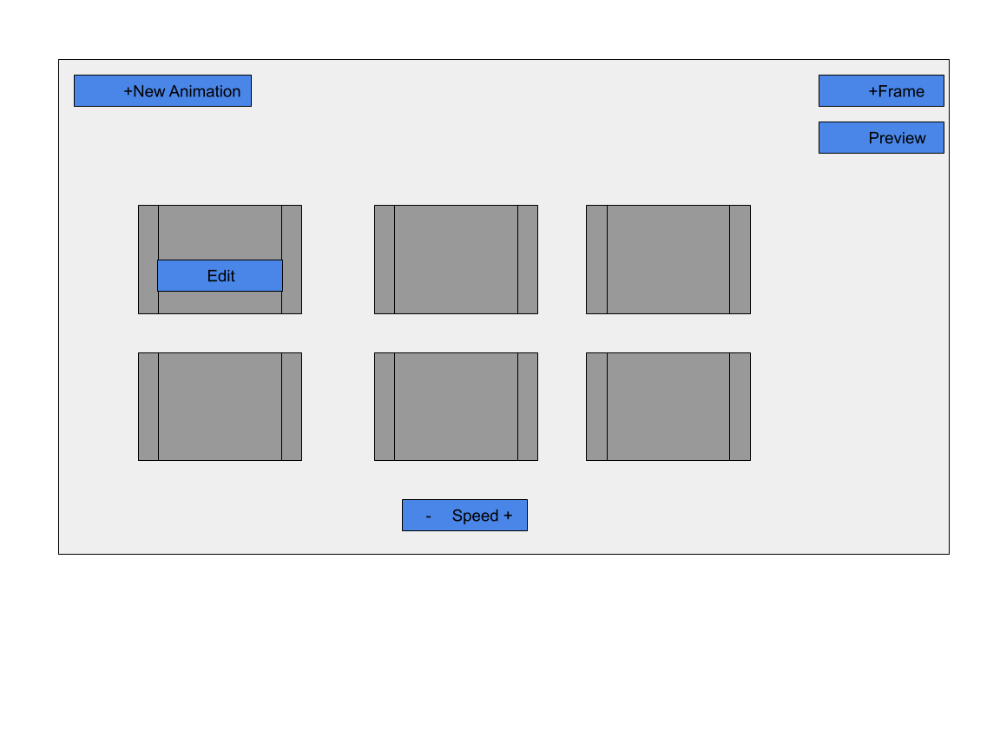
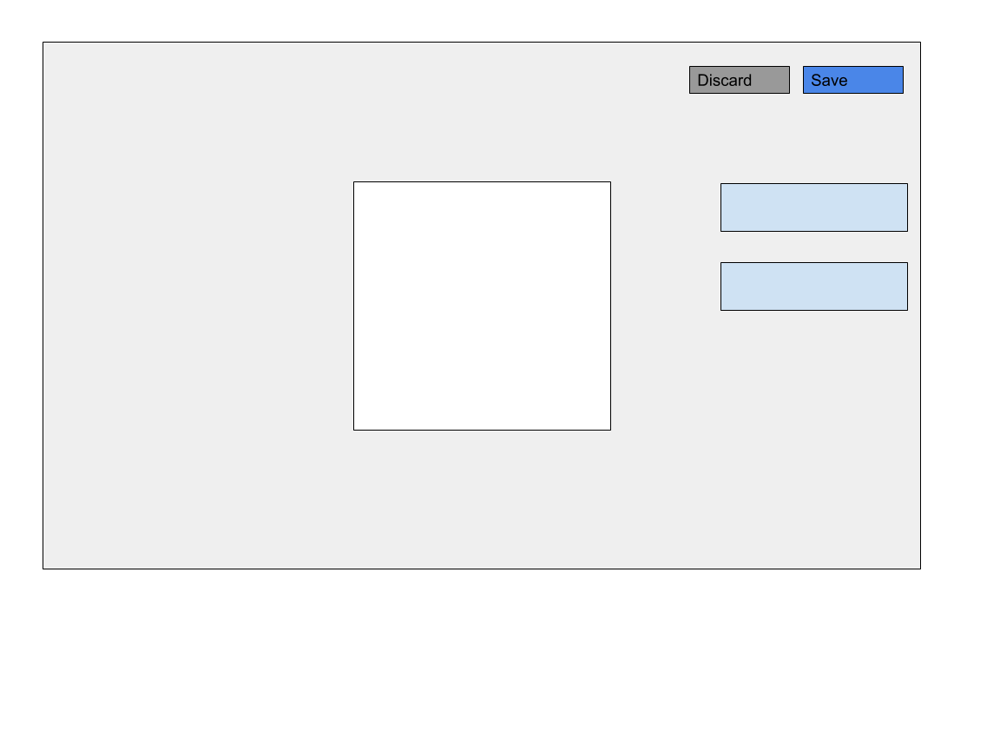

# animation-studio

AnimationStudio is a basic pixel art editor that allows users to combine 'frames' of pixel art to create animations.

## Design
The user will be able to piece together individual frames, select a frame to edit, and preview an animation from within the studio.

Changes to frames will take place in the frame editor, where users can select from a palette of color options to change pixels.

## Running / Development

* `git clone <repository-url>` this repository
* `cd animation-studio`
* `npm install`
* `ember serve`
* Visit your app at [http://localhost:4200](http://localhost:4200).
